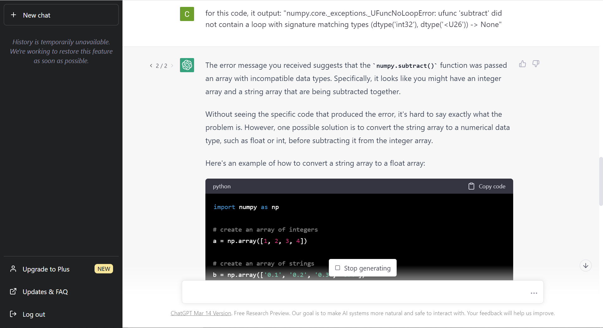
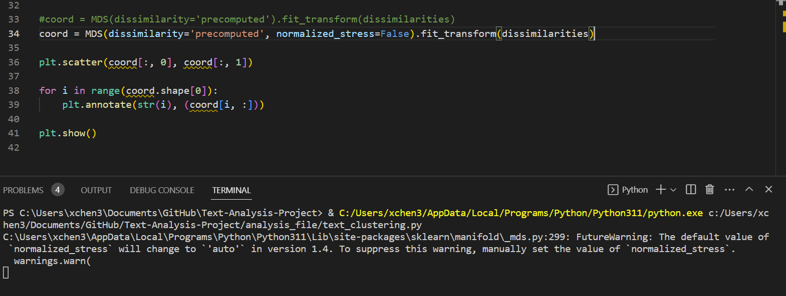
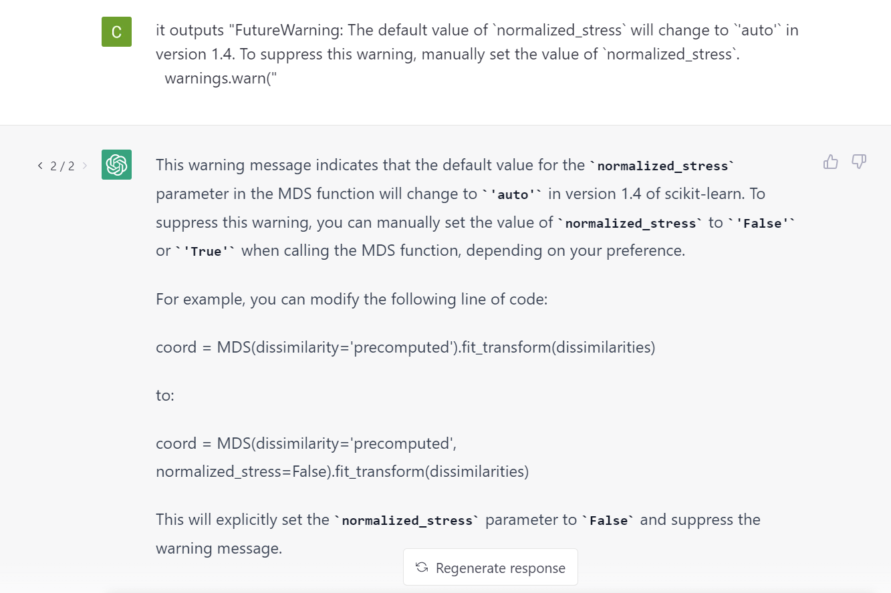
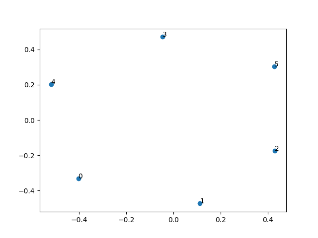

# **Text-Analysis-Project by Charlotte**

## **Project Overview**
 I used an eBook written by my favorite author, Oscar Wilde, called *The Picture of Dorian Gray* from the Project Gutenberg. WIth this source, I conducted most individual analysis with it (word frequency, sentiment analysis). 

 Besides, I am interested in Oscar Wilde's personal writing pattern, compare and contrast him with other famous writers of the era. I use especially in finding text similarity part is *The Happy Prince and Other Tales*, *De Profundis*, and *The Importance of Being Earnest* by Oscar Wilde (different genres). Also, I selected two close friends and admirer of him in the Victorian literature circle: *The Gentle Art of Making Enemies*, by James McNeill Whistler and *The Story of Venus and Tannhäuser*, by Aubrey Beardsley. To explore how his life instances effect his writing style and the linguistic pattern of that era. I did text clustering and generate a scatter plot out of the results. 
 
 
 ### **Data Source**
 1. [*The Picture of Dorian Gray* by Oscar Wilde](http://www.gutenberg.org/ebooks/174.txt.utf-8)
 2. [*The Happy Prince and Other Tales* by Oscar Wilde](https://www.gutenberg.org/cache/epub/30120/pg30120.txt)
 3. [*De Profundis* by Oscar Wilde](https://www.gutenberg.org/cache/epub/921/pg921.txt)
 4. [*The Importance of Being Earnest* by Oscar Wilde](https://www.gutenberg.org/files/844/844-0.txt)
 5. [*Poems* by Oscar Wilde, Edited by Robert Ross](https://www.gutenberg.org/files/1057/1057-0.txt)
 6. [*The Gentle Art of Making Enemies*, by James McNeill Whistler](https://www.gutenberg.org/cache/epub/24650/pg24650.txt)
 7. [*The Story of Venus and Tannhäuser*, by Aubrey Beardsley](https://www.gutenberg.org/cache/epub/50210/pg50210.txt)
 8. [A stopword list](stopwords.txt)

## **Implementation**
 ### [Word Usage Frequency Analysis](frequency_analysis.py)
 For the **first** part, I did some basic processing with the text so that it becomes histogram (words with frequency instead of a simple list of word itself). It is better as in finding the word variety. Before, I did list which is like below (Which will also lead to changes in the other functions, but for clarity, I will just show the first function)
```
 def process_text(text):
    """
    Processes the text and returns a list of the words used in the book. 
    """
    words = []
    for line in text.split('\n'):
        line = line.strip().lower()
        for word in line.split():
            # remove punctuations from the word
            word = word.translate(str.maketrans('', '', string.punctuation))
            words.append(word)
    return words
```

However it turns out that histogram is better to analyze the "rare" words in the book and frequency of those which is better in calculating the lanaguge usage patterns like does Oscar Wilde has certain rare words that he likes to use a lot? (after excluding the stopwords from Professor Li's source). Using a dictionary to store the histogram leads to easier lookup of the word frequencies. 

Also, I initially wrote the codes without define any function.

```
url = 'http://www.gutenberg.org/ebooks/174.txt.utf-8'
with urllib.request.urlopen(url) as f:
    text = f.read().decode('utf-8')

words = text.split()

word_freq = {}
for word in words:
    if word not in word_freq:
        word_freq[word] = 1
    else:
        word_freq[word] += 1

# Computing Summary Statistics
sorted_freq = sorted(word_freq.items(), key=lambda x: x[1], reverse=True)
# word_freq.items is tuple, and lambda returns the second value of the tuple which is the frequency
for word, count in sorted_freq[:10]:  # return the first 10 tuples
    print(f'{word}: {count}')

words = text.split()
stop_words = {'the', 'and', 'a', 'an', 'or', 'but', 'not',
              'at', 'in', 'on', 'to', 'of'}  # self-defined stop words
words_without_stop_words = [
    word for word in words if word.lower() not in stop_words]

filtered_words = [word for word in words if word.lower() not in stop_words]

word_freq = {}
for word in words_without_stop_words:
    if word not in word_freq:
        word_freq[word] = 0
    word_freq[word] += 1

sorted_word_freq = sorted(word_freq.items(), key=lambda x: x[1], reverse=True)
for word, count in sorted_word_freq[:10]:
    print(f'{word}: {count}')
```

However, when I want to do analysis again for another book *The Happy Prince and Other Tales*, I found that I have to copy and paste the whole codes again and change every input name to differentiate. Function with a def main which allows variable input is more convenient. 
 
The process_text function generates a dictionary to store the word frequencies, while the load_stopwords function generates a set to store the stop words. The most_common function generates a list of tuples, where the first element is the frequency and the second element is the word. The subtract function generates a dictionary of the difference between two histograms.

### [Book Analysis with NLK and NTLK](book_analysis.py)/ [Text Similarity](text_similarity.py)/[Text Clustering](text_clustering.py)

For [Book Analysis with NLK and NTLK](book_analysis.py), the data structures in these codes includes multiple lists and tuples. "sentences" is a list of sentences gathered and split through using "sent_tokenize" to process the input text. "score" is the output in form of tuples of of each sentence and its sentiment score. In understanding the sentiment analysis, ChatGPT helps on the choice of VADER (Valence Aware Dictionary and Sentiment Reasoner) which is a rule-based approach and machine-learning-based approach. 

For [Text Similarity](text_similarity.py), the fuzz listed in the instruction does not work, so I asked ChatGPT again to debug my code while my codes output an error to retrieve an package. And instead, I find out that I should use fuzzywuzzy library. The fuzz.ratio() can calculate the text similarity score; fuzz.token_set_ratio can find the most similar words between two texts (https://medium.com/nlpgurukool/fuzzy-matching-1baac719aa25). According to https://www.geeksforgeeks.org/fuzzywuzzy-python-library/, it is based on Levenshtein distance, which is minimum number of edits required to transform one string to another. Also, because I changed my analysis goal several times and realize that I should analyze the similarity score among many texts, so I changed my code to a function instead of a direct comparison between two books which I initially did (shown below). 

```
words1 = set(text.split())  
words2 = set(text2.split()) 
similarity_scores = [(w, fuzz.token_set_ratio(w, words2)) for w in words1]
```

To a function that allows more combination of text to compute the scores: 

```
def compare_texts(url1, url2):
    with urllib.request.urlopen(url1) as f:
        text1 = f.read().decode('utf-8')
    with urllib.request.urlopen(url2) as g:
        text2 = g.read().decode('utf-8')
        
    similarity_score = fuzz.ratio(text1, text2)
    print("Text similarity score:", similarity_score)
    
    words1 = set(text1.split())
    words2 = set(text2.split())
    
    similarity_scores = [(w, fuzz.token_set_ratio(w, words2)) for w in words1]
    most_similar = sorted(similarity_scores, key=lambda x: x[1], reverse=True)[:10]
    
    print("Top 10 most similar words:")
    for word, score in most_similar:
        print(f"{word}: {score}")
```

For [Text Clustering](text_clustering.py), there are 7 texts used to draw the plot. There is a iteration through the list of different tets and create a set of words that appear in each text to find the similarity coefficient. It will take all sets to generate the ratio of the size of intersection of the word sets and stored the results in the two dimensional way. It uses sets, which is a very efficient data structure here. I used chatgpt to understand more about numpy package and how to generate codes for scores of several texts.

<!--  -->

<!--  -->

<!--  -->


While first running the MDS for clustering, I got several error messages. 
<!--  -->

And ChatGPT helps me through the problem, and explain why my codes are incorrect. 
<!--  -->


In intepretting the result of my scatter plot, before meeting with Professor Li, I asked ChatGPT what does it mean by the numbers and axis. 
<!--  -->


## Result
### Book Summary Stats 

In the book *The Picture of Dorian Gray*, there are over 8000 new words used which shows that Oscar Wilde tends to use a wide variety of words in his writing; this can be indicative of his writing skills gained from his Oxford education backgrounds and literature circle. Also, this is a serious literature work for adults, so the vocabulary is more diverse. Other books like *The Importance of Being Earnest* also show this trend with a 12674/23791 word-count that is not stop words. However, none of the other works is as elegant with variety like *The Picture of Dorian Gray*; this may lead to the book's great success in Victorian literature. 

```
Total number of words: 82027
Number of different words: 8525
The most common words are:     
one      368
dorian   352
“i       289
said     260
lord     245
don’t    232
henry    217
life     213
will     208
like     207
gray     168
man      167
know     167
never    166
must     163
things   125
“you     124
see      123
now      123
us       121
```

However, on the contrary, *The Happy Prince and Other Tales*, which is a fairy tale targeting the children as audience, has only 2797 different words while only 9479/19635 words are not stop words. Also the top-used words are simple just like what children's books are expected. 

```
Total number of words: 19635
Number of different words: 2797
The most common words are:     
said     174
little   128
will     91
project  87
one      63
hans     63
cried    63
like     59
prince   55
swallow  54
work     53
rose     49
miller   48
great    46
garden   46
rocket   42
quite    42
         42
happy    40
```

## Sentiment Score Analysis
For *The Picture of Dorian Gray*, all sentences have a sentiment score ranging from -0.5994 to -0.9638, meaning the whole book is completely full of negative emotions without any positive upwarding sentences. Below is an example of output for a sentence. The overall tone is perceived to be negative, which is the characteristics of Oscar Wilde's focus on individual struggles and sufferings.  

```
There were two cries heard, the cry of a hare in pain, which is dreadful, the cry of a man in agony, which is
worse. -0.9638
```

*De Profundis*, which has a sentiment score ranging from 0.0(Gutenburg Description of Copyrights), -0.1655 (highest score in text) to -0.9917. This is a much lower score, because this is during the time when he was betrayed by his lover and thrown to jail. 

```
Out of my nature has come wild despair; an abandonment to grief that was piteous even to look at;
terrible and impotent rage; bitterness and scorn; anguish that wept aloud; misery that could find no voice; sorrow that was dumb. -0.9917
```

However, for the fairy tales like *The Happy Prince and Other Tales*, the sentiment score is shown to be inclined to negativity which should not be the result given the nature of fairy tale for kids. So, I learnt that the SentimentIntensityAnalyzer may not be the best tool here. It uses a lexicon-based approach to look up words in a pre-defined list and assigns positive, negative, or neutral scores based on their presence in that list. This may not be efficient becasue of Wilde's word choice is normally associated with negative prefix or suffix, even in happy stories (with sad essence). 

## Text Similarity & Text Clustering
The similarity score between *The Picture of Dorian Gray* (abbreviated to DG afterwords) and *The Happy Prince* (abbreviated to HP) is 31, with *De Profundis* (abbreviated to DP) is 32, with *The Importance of Being Earnest* (BE) is 33, with *The Gentle Art of Making Enemies* by James McNeill Whistler is 42, with *The Story of Venus and Tannhäuser* by Aubrey Beardsley is 27. It is interesting that among works of Oscar Wilde himself and friends, *The Gentle Art of Making Enemies" by James McNeill Whistler has a highest similarity score. He was a very close friend with Wilde, constantly communicating through telegrams. James McNeill Whilstler, as a painter, through the commmunications, gained a similar word choice pattern as Oscar Wilde. Instead, Wilde's work and his admirer Aubrey Beardley's works are very different as shown from the text similarity scores and scatter plot. While Victorian Era is more about revealing personal struggles, there are huge individual differences on presentation of words. 

<!--  -->


Quotations:
[Whistler as a Friend](https://lewisartcafe.com/oscar-wilde-on-whistler-and-vice-a-versa/)
[Victorian Writers](https://victorian-era.org/victorian-era-literature-characteristics.html)

Ten most similar words in DG and HP is "provide, dream, reason, much? is. gone, terms, lovlier"; in DG and DP is "platform, pattern, comeliness, kiss, spoken, tell, morbid, water-ways, tired". From these, there is a trend of connotations in the different texts; while serious literature normally have common in neutral or negative words like "morbid" and "tired"; while fairy tales have mostly neutral and positive words like "dream", "lovlier". 


## Reflection 
With the text retrieved from a URL, summary statistics of the text, and the first few attempts with NLTK and text clustering after learning and adapting the example code to my case, I made good progress. However, when trying to convert the messy code into clear functions and debugging errors, it took too much time without sufficient knowledge of sentiment analysis, MDS, and fuzzywuzzy. ChatGPT was very helpful in debugging, especially in interpreting the example codes line by line, explaining the error messages, and identifying the root mistake, as explained in the implementation part. The project is well-scoped in analyzing the linguistic pattern of various authors, especially Oscar Wilde and how his major writings vary in styles. My analysis focuses on word choice, sentiment, and similarity to find a pattern and trend of the era. So, the functions I wrote successfully provide enough quantitative results for that question. 

I based my testing on six texts to ensure that my codes are robust and functional, and to see whether I obtain the expected output. I separated the parts into four Python files so that I could test each section individually and debug in a timely manner. I wish I had known about NLTK, tokenization, and NLP before starting this project so that I could have had more time to explore other possibilities of text analysis, such as topic modeling (identifying the topics present in a collection of texts) and syntax analysis (analyzing the grammatical structure of sentences). These methods would provide additional insights into my data, as sentiment score is not highly correlated with genres, as I had assumed. Therefore, more analysis with syntax, the number of adjectives, and descriptive language analysis would be better. 
